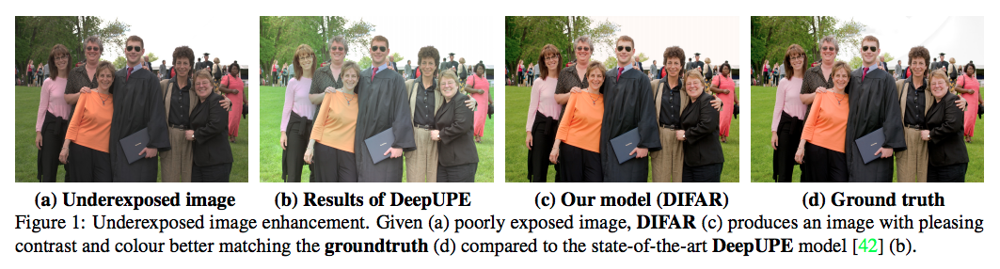

# DIFAR: Deep Image Formation and Retouching (Pre-print, paper under review)

### [[Paper]](https://arxiv.org/pdf/1911.13175) 

<p align="center">

</p>
Repository for the paper DIFAR: Deep Image Formation and Retouching. Here you will find the code, pre-trained models, information of the datasets, and information on the training procedure for our models. Please raise a Github issue if you need assistance of have any questions on the research. 
<p></p>

If you do use ideas from the paper in your research please kindly consider citing as below:

```
@misc{moran2019difar,
    title={DIFAR: Deep Image Formation and Retouching},
    author={Sean Moran and Gregory Slabaugh},
    year={2019},
    eprint={1911.13175},
    archivePrefix={arXiv},
    primaryClass={eess.IV}
}
```

### Datasets

* __Samsung S7__: this dataset can be downloaded [here](https://www.kaggle.com/knn165897/s7-isp-dataset). We use images for our test dataset, images for our validation dataset and the remaining images for training

  * Validation Dataset Images

    * S7-ISP-Dataset-20161110_125321
    * S7-ISP-Dataset-20161109_131627
    * S7-ISP-Dataset-20161109_225318
    * S7-ISP-Dataset-20161110_124727
    * S7-ISP-Dataset-20161109_130903
    * S7-ISP-Dataset-20161109_222408
    * S7-ISP-Dataset-20161107_234316
    * S7-ISP-Dataset-20161109_132214
    * S7-ISP-Dataset-20161109_161410
    * S7-ISP-Dataset-20161109_140043


  * Test Dataset Images
  
    * S7-ISP-Dataset-20161110_130812
    * S7-ISP-Dataset-20161110_120803
    * S7-ISP-Dataset-20161109_224347
    * S7-ISP-Dataset-20161109_155348
    * S7-ISP-Dataset-20161110_122918
    * S7-ISP-Dataset-20161109_183259
    * S7-ISP-Dataset-20161109_184304
    * S7-ISP-Dataset-20161109_131033
    * S7-ISP-Dataset-20161110_130117
    * S7-ISP-Dataset-20161109_134017
    
* __Adobe-DPE__: this dataset can be downloaded [here](https://data.csail.mit.edu/graphics/fivek/). After downloading this dataset you will need to use Lightroom to pre-process the images according to the procedure outlined in the DeepPhotoEnhancer (DPE) [paper](https://github.com/nothinglo/Deep-Photo-Enhancer). Please contact me or raise a Gitlab issue if you need assistance with this (or the Adobe-UPE dataset below).

* __Adobe-UPE__: this dataset can be downloaded [here](https://data.csail.mit.edu/graphics/fivek/). Again, after downloading this dataset you will need to use Lightroom to pre-process the images according to the procedure outlined in the Underexposed Photo Enhancement Using Deep Illumination Estimation (DeepUPE) [paper](https://github.com/wangruixing/DeepUPE). 
